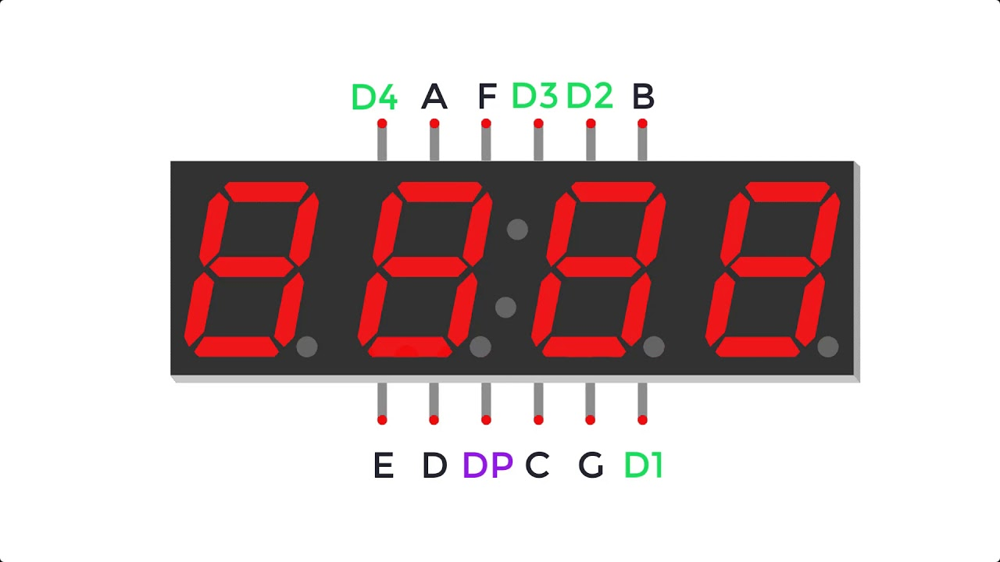
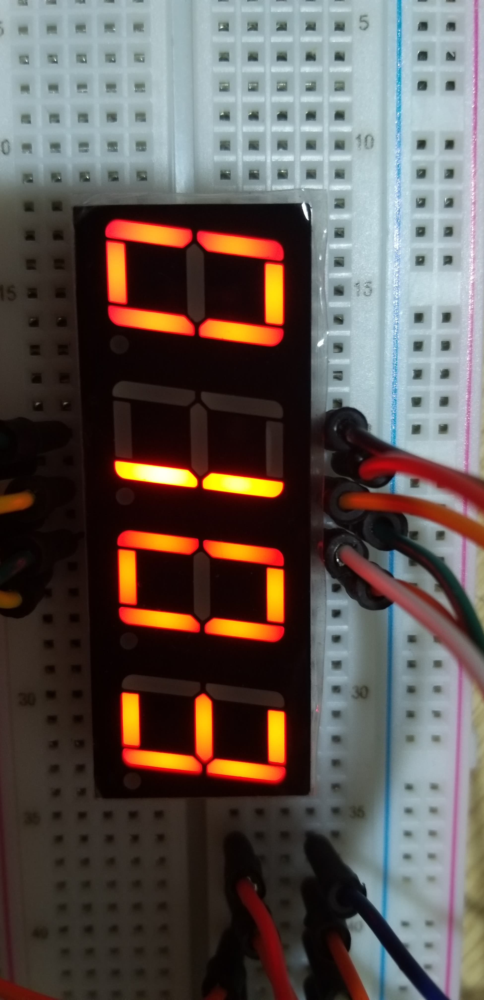

# **4 Digit 7 Segment LED Display: How to count from 0000 to 9999 ?**

## **1. Problem**

<br>

[][1]

[1]: http://www.xlitx.com/Products/7-segment-led-dot-matrix/5641as.html


According to this principal circuit, 4 digits LED are controlled with the same combination of pins. Technically, we are not able to show different numbers on the display ***at a time***. 

**Turn back with above question: How to count from 0000 to 9999 using 4 Digit 7 Segment Display ?**

**I will show you a solution for this problem.**

<br>
<br>

## **2. Solution**
### 2.1. Principle

Before going further, I highly recommend that you should watch this video to understand the principle.
(Click the picture to link to the video).

[][2]

[2]: https://www.youtube.com/watch?v=fYAlE1u5rno&ab_channel=MakeCrate "Principle Video"

<br>

### 2.2. Pins connection

> You can connect in another way but it could be more difficult to write code.

> I suggest that you should use following source code. 


| Arduino Pin 	| Letter Symbol 	| LED Pin 	|          Annotations         	|
|:-----------:	|:-------------:	|:-------:	|:----------------------------:	|
|      1      	|       DP      	|    3    	|                              	|
|      2      	|       A       	|    11   	|                              	|
|      3      	|       B       	|    7    	|                              	|
|      4      	|       C       	|    4    	|                              	|
|      5      	|       D       	|    2    	|                              	|
|      6      	|       E       	|    1    	|                              	|
|      7      	|       F       	|    10   	|                              	|
|      8      	|       G       	|    5    	|                              	|
|  ========== 	|  ============ 	|  ====== 	|  =========================== 	|
|      10     	|       D1      	|    12    	| In series with 1 kΩ resistor 	|
|      11     	|       D2      	|    9    	| In series with 1 kΩ resistor 	|
|      12     	|       D3      	|    8    	| In series with 1 kΩ resistor 	|
|      13     	|       D4      	|    6    	| In series with 1 kΩ resistor 	|

<br>

### 2.3 Source code

```
/*
          A
      |=======|
    F |   G   | B
      |=======|
    E |       | C
      |=======|   o DP
          D
*/

/*
   Pin the circuit as below

   DP - 1
   A - 2
   B - 3
   C - 4
   D - 5
   E - 6
   F - 7
   G - 8

   D1 - 10
   D2 - 11
   D3 - 12
   D4 - 13
*/

#define DP 1
#define A 2
#define B 3
#define C 4
#define D 5
#define E 6
#define F 7
#define G 8

#define D1 10
#define D2 11
#define D3 12
#define D4 13

/* arr[i] is the combination of bit to activate LED segments for number i */
unsigned char arr[] = {0b01111110, 0b00110000, 0b01101101, 0b01111001, 0b00110011,
                       0b01011011, 0b01011111, 0b01110000, 0b01111111, 0b01111011
                      };

/* delay time means the instance of time that the number display */
/* if delay time is 1000, it means each number will be displayed in 1 second */
const int delay_time = 25; /* here I set it equals to 10 ms */ 


void all_off()
{
  digitalWrite(D1, HIGH);
  digitalWrite(D2, HIGH);
  digitalWrite(D3, HIGH);
  digitalWrite(D4, HIGH);

  digitalWrite(A, LOW);
  digitalWrite(B, LOW);
  digitalWrite(C, LOW);
  digitalWrite(D, LOW);
  digitalWrite(E, LOW);
  digitalWrite(F, LOW);
  digitalWrite(G, LOW);
  digitalWrite(DP, LOW);
}


void all_on()
{
  digitalWrite(D1, LOW);
  digitalWrite(D2, LOW);
  digitalWrite(D3, LOW);
  digitalWrite(D4, LOW);

  digitalWrite(A, HIGH);
  digitalWrite(B, HIGH);
  digitalWrite(C, HIGH);
  digitalWrite(D, HIGH);
  digitalWrite(E, HIGH);
  digitalWrite(F, HIGH);
  digitalWrite(G, HIGH);
  digitalWrite(DP, HIGH);
}


void digit(int value)
{
  all_off();
  digitalWrite(value, LOW);
}


void display_led(int value)
{
  for (int i = 0; i < 8; i++)
  {
    digitalWrite((i + 1), bitRead( arr[value], (7 - i) ));
  }
}


void setup()
{
  Serial.begin(9600);
  for (int i = 1; i <= 8; i++)
    pinMode(i, OUTPUT);

  pinMode(D1, OUTPUT);
  pinMode(D2, OUTPUT);
  pinMode(D3, OUTPUT);
  pinMode(D4, OUTPUT);

  all_off();
}


void loop()
{
  int digit_1, digit_2, digit_3, digit_4;
  /* A for loop to runs from 0000 to 9999 */
  for (int index = 0; index <= 9999; index++)
  {
    digit_4 = index % 10;
    digit_3 = (index / 10) % 10;
    digit_2 = (index / 100) % 10;
    digit_1 = (index / 1000) % 10;

    int arr_digit[4] = {digit_1, digit_2, digit_3, digit_4};

    /* A loop to display each number in a certain time for observation */
    for (int tick = 0; tick <= 4 * delay_time; tick++)
    {
      /* A loop to activate consequently first digit, then second digit, then third digit... etc. */
      for (int active = 10; active <= 13; active++)
      {
        /*
            For first digit (pin 10), have to display arr_digit[0]
            For second digit (pin 11), have to display arr_digit[1]
            For third digit (pin 12), have to display arr_digit[2]
            For fourth digit (pin 13), have to display arr_digit[3]
        */
        digit(active);
        display_led(arr_digit[active - 10]);
        delay(1);
      }
    }

  }
}
```
<br>

### 2.4. Result

<br>

Click into the figure to download the video.

[][3]

[3]: https://f10-zvc.zdn.vn/babe93964c40a51efc51/800028327228144420 "Result Video"


<br>
<br>

## 3. Conclusion
- Counting from 0000 to 9999 with [4 Digit 7 Segment Display] is much harder than counting from 0 to 9 with [1 Digit 7 Segment Display]. 
- Mentioned in principle video, this displaying uses a mechanism of human eyes: [**Persistence of Eyes**][4]
  
[4]: https://vi.wikipedia.org/wiki/Hi%E1%BB%87n_t%C6%B0%E1%BB%A3ng_l%C6%B0u_%E1%BA%A3nh_tr%C3%AAn_v%C3%B5ng_m%E1%BA%A1c "Persistence of Human Eyes"

<br>
<br>

---

## Author
- Name: Ly Duc Trung
- Email: <lyductrungmoney@gmail.com>
- Majors: Automation Engineering
- Workplace: Hanoi University of Science and Technology

